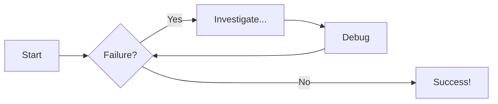
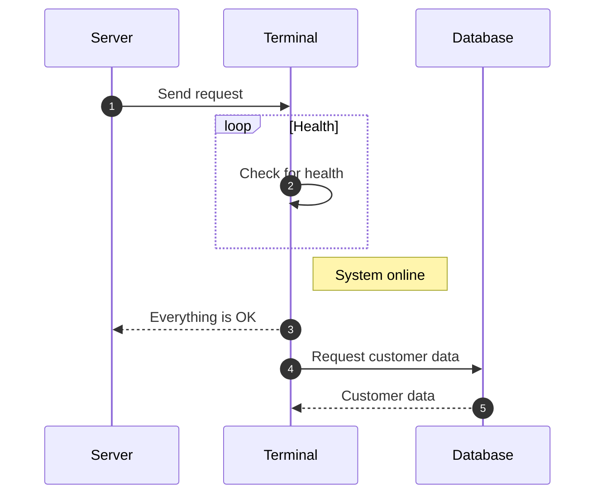

# Welcome to MkDocs

For full documentation visit [mkdocs.org](https://www.mkdocs.org).

## Commands

* `mkdocs new [dir-name]` - Create a new project.
* `mkdocs serve` - Start the live-reloading docs server.
* `mkdocs build` - Build the documentation site.
* `mkdocs -h` - Print help message and exit.

## Project layout

    mkdocs.yml    # The configuration file.
    docs/
        index.md  # The documentation homepage.
        ...       # Other markdown pages, images and other files.

```python title="Add Two Numbers" linenums="1"
# Function to add two numbers
def add_two_numbers(num1, num2):
    return num1 + num2

# Example usage
result = add_two_numbers(5, 3)
print('The sum is:', result)
```

感觉不错 :smile:

## Content Tabs

This is some examples of content tabs.

### Generic Content

www

=== "Plain text"

    This is some plain text

=== "Unordered list"

    * First item
    * Second item
    * Third item

=== "Ordered list"

    1. First item
    2. Second item
    3. Third item

www

### Code Blocks in Content Tabs

=== "Python"

    ```py
    def main():
        print("Hello world!")

    if __name__ == "__main__":
        main()
    ```

=== "JavaScript"

    ```js
    function main() {
        console.log("Hello world!");
    }

    main();
    ```


!!! note "Title of the callout"

    Lorem ipsum dolor sit amet, consectetur adipiscing elit. Nulla et euismod
    nulla. Curabitur feugiat, tortor non consequat finibus, justo purus auctor
    massa, nec semper lorem quam in massa.


# Diagram Examples

## Flowcharts




## Sequence Diagrams


